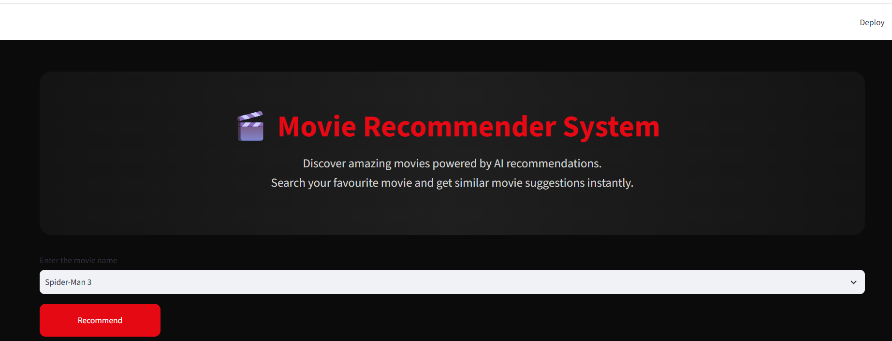
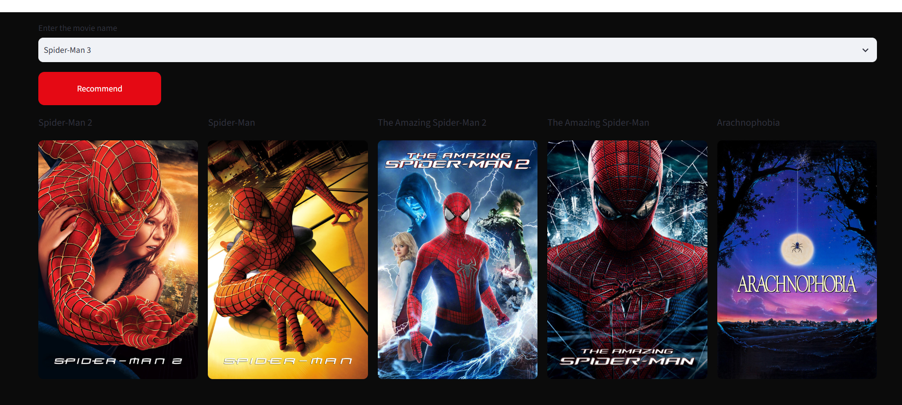

# 🎬 Movie Recommender System

## 📌 About Project


This project uses a content-based filtering approach to recommend movies.

It analyzes movie features like genres, keywords, cast, and overview to find similar movies using cosine similarity.

## 🚀 Features

- Recommend top 5 similar movies
- Displays movie posters using TMDB API
- Clean and responsive Streamlit UI
- Fast recommendation using cosine similarity


## 🛠️ Technologies Used

- Python
- Pandas
- Scikit-learn
- Streamlit
- TMDB API
- Pickle

## 📂 Dataset


- TMDB 5000 Movies Dataset
- TMDB 5000 Credits Dataset


## ▶️ How to Run

1. Clone the repository


```bash

git clone https://github.com/Shreya0521dev/Movie-Recommender-System.git

```


2. Install dependencies


```bash

pip install -r requirements.txt

```


3. Run the application


```bash

streamlit run app.py

```

## 📸 Screenshots

### Home Page


### Recommendation Result



